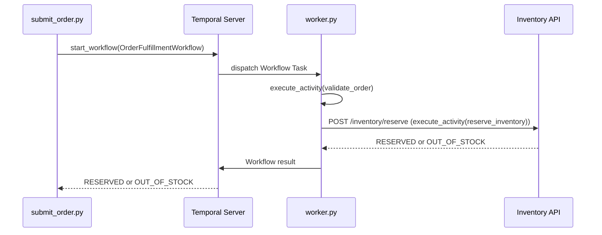

# Order Fulfillment — Temporal Project

A durable order-fulfillment system built with the Temporal Python SDK, extended weekly from order intake through payment, shipping, delivery, and returns.

## Architecture

- `workflows/` — Workflow definitions. Orchestration only, no direct I/O, per Temporal's determinism rule.
- `activities/` — Activity definitions. All real work (HTTP calls to mock services) happens here, since Activity results are recorded in Event History and are safe to call from a Workflow.
- `mock_services/` — Standalone FastAPI apps simulating third-party systems (Inventory, Payment, Shipping).
- `worker.py` — Connects to the Temporal server and registers Workflows/Activities on the `order-fulfillment-tq` task queue.
- `submit_order.py` — CLI that starts a Workflow execution for a given order JSON file.
- `sample_orders/` — Example order payloads used for testing and demos.
- `screenshots/` — Event History captures per week, used as checkpoint evidence.

## Week 1 — Foundations: Order Intake & Inventory Reservation

### What it does
`OrderFulfillmentWorkflow` takes an order, calls `ValidateOrderActivity` to check it's well-formed, then calls `ReserveInventoryActivity`, which reserves stock against the mock Inventory service using an all-or-nothing check: every item's availability is checked before any item is reserved, so a partially-available multi-item order fails cleanly without leaving any stock reserved.

### Flow

### How to run it
1. `temporal server start-dev` — starts the local Temporal server and Web UI (`localhost:8080`)
2. `uvicorn mock_services.inventory.main:app --reload --port 8001` — starts the mock Inventory service
3. `python worker.py` — starts the Worker
4. `python submit_order.py --order sample_orders/order1.json` — submits an order

### Sample orders and results
| Order | Scenario | Result |
|---|---|---|
| order1.json | Single item, in stock | RESERVED |
| order2.json | Single item, in stock | RESERVED |
| order3.json | Single item, zero availability | OUT_OF_STOCK |
| order4.json | Multi-item, both available | RESERVED |
| order5.json | Multi-item, one unavailable (all-or-nothing) | OUT_OF_STOCK |
| order7.json | Crash-recovery test | RESERVED |

See `screenshots/week1/` for Event History captures of each.

### Crash-recovery test
`reserve_inventory` was given a deliberate 15-second delay. The Worker was killed mid-execution (during the sleep) and restarted. The order still completed correctly.

When a Worker restarts, Temporal doesn't restart the Workflow from scratch. Instead, it replays the Event History to reconstruct where the Workflow left off. In this test, `validate_order` shows only one Scheduled/Started/Completed sequence, Attempt 1, because it had already completed before the Worker was killed, so on replay its result is read straight from history instead of being re-executed. `reserve_inventory` is different: the Worker was killed while it was still sleeping, before that attempt could report back, so Temporal had no result recorded for it. When the Worker restarted, the Event History shows the Activity was dispatched again as Attempt 2, which ran the full delay and the real HTTP call and completed successfully. This shows the difference between replay and retry: the Workflow replayed its already-completed decision for `validate_order` straight from history, while `reserve_inventory` itself was retried as a new attempt because it never finished the first time.

See `screenshots/week1/order7-crash-recovery.png` for the Event History showing Attempt 2 on `reserve_inventory`.

### Idempotent reservation
`reserve_inventory`'s underlying call to the Inventory service is idempotent on `order_id`: the service caches the result of the first successful request for a given order_id and returns that cached result on any subsequent call with the same order_id, without re-checking availability or re-reserving stock. This protects against Temporal retrying the Activity (for example, after a Worker crash where the first attempt's success was never reported back) and accidentally reserving the same inventory twice.
