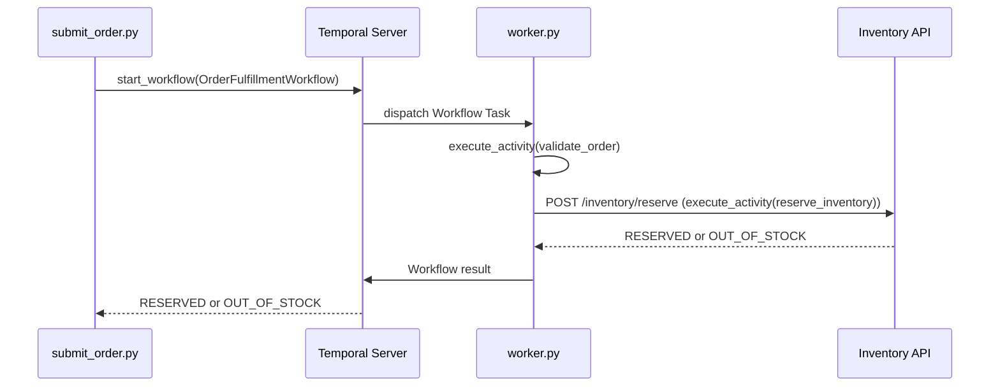
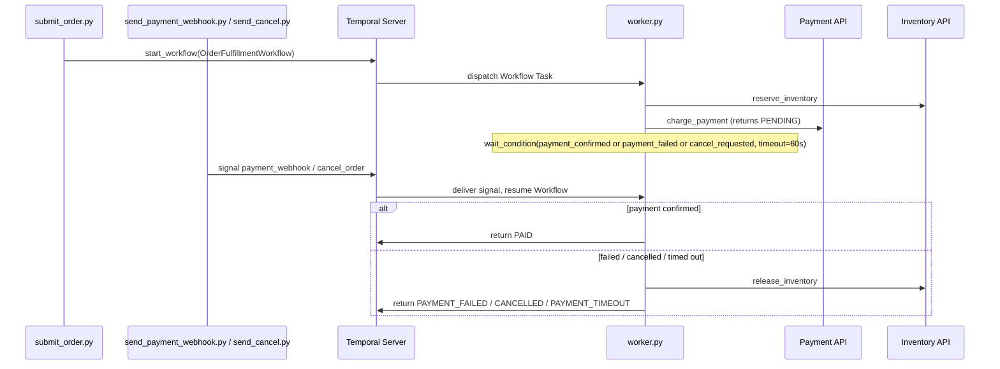
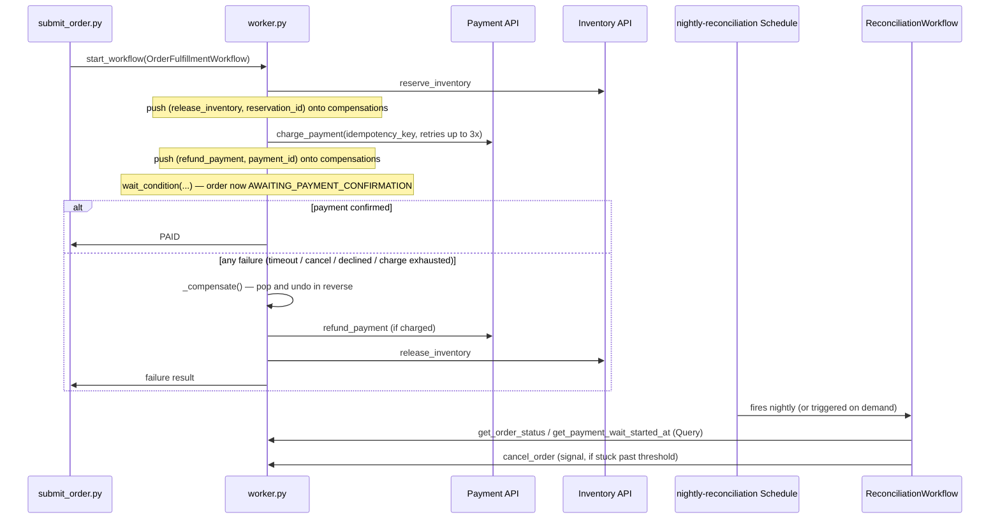

# Order Fulfillment — Temporal Project

A durable order-fulfillment system built with the Temporal Python SDK, extended weekly from order intake through payment, shipping, delivery, and returns.

## Architecture

- `workflows/` — Workflow definitions. Orchestration only, no direct I/O, per Temporal's determinism rule.
- `activities/` — Activity definitions. All real work (HTTP calls to mock services) happens here, since Activity results are recorded in Event History and are safe to call from a Workflow.
- `mock_services/` — Standalone FastAPI apps simulating third-party systems (Inventory, Payment, Shipping).
- `worker.py` — Connects to the Temporal server and registers Workflows/Activities on the `order-fulfillment-tq` task queue.
- `submit_order.py` — CLI that starts a Workflow execution for a given order JSON file.
- `sample_orders/` — Example order payloads used for testing and demos.
- `screenshots/` — Event History captures per week, used as checkpoint evidence.

## Week 1 — Foundations: Order Intake & Inventory Reservation

### What it does
`OrderFulfillmentWorkflow` takes an order, calls `ValidateOrderActivity` to check it's well-formed, then calls `ReserveInventoryActivity`, which reserves stock against the mock Inventory service using an all-or-nothing check: every item's availability is checked before any item is reserved, so a partially-available multi-item order fails cleanly without leaving any stock reserved.

### Flow

```mermaid
sequenceDiagram
    participant CLI as submit_order.py
    participant Temporal as Temporal Server
    participant Worker as worker.py
    participant Inv as Inventory API

    CLI->>Temporal: start_workflow(OrderFulfillmentWorkflow)
    Temporal->>Worker: dispatch Workflow Task
    Worker->>Worker: execute_activity(validate_order)
    Worker->>Inv: POST /inventory/reserve (execute_activity(reserve_inventory))
    Inv-->>Worker: RESERVED or OUT_OF_STOCK
    Worker->>Temporal: Workflow result
    Temporal-->>CLI: RESERVED or OUT_OF_STOCK
```

### How to run it
1. `temporal server start-dev` — starts the local Temporal server and Web UI (`localhost:8080`)
2. `uvicorn mock_services.inventory.main:app --reload --port 8001` — starts the mock Inventory service
3. `python worker.py` — starts the Worker
4. `python submit_order.py --order sample_orders/order1.json` — submits an order

### Sample orders and results
| Order | Scenario | Result |
|---|---|---|
| order1.json | Single item, in stock | RESERVED |
| order2.json | Single item, in stock | RESERVED |
| order3.json | Single item, zero availability | OUT_OF_STOCK |
| order4.json | Multi-item, both available | RESERVED |
| order5.json | Multi-item, one unavailable (all-or-nothing) | OUT_OF_STOCK |
| order7.json | Crash-recovery test | RESERVED |

See `screenshots/week1/` for Event History captures of each.

### Crash-recovery test
`reserve_inventory` was given a deliberate 15-second delay. The Worker was killed mid-execution (during the sleep) and restarted. The order still completed correctly.

When a Worker restarts, Temporal doesn't restart the Workflow from scratch. Instead, it replays the Event History to reconstruct where the Workflow left off. In this test, `validate_order` shows only one Scheduled/Started/Completed sequence, Attempt 1, because it had already completed before the Worker was killed, so on replay its result is read straight from history instead of being re-executed. `reserve_inventory` is different: the Worker was killed while it was still sleeping, before that attempt could report back, so Temporal had no result recorded for it. When the Worker restarted, the Event History shows the Activity was dispatched again as Attempt 2, which ran the full delay and the real HTTP call and completed successfully. This shows the difference between replay and retry: the Workflow replayed its already-completed decision for `validate_order` straight from history, while `reserve_inventory` itself was retried as a new attempt because it never finished the first time.

See `screenshots/week1/order7-crash-recovery.png` for the Event History showing Attempt 2 on `reserve_inventory`.

### Idempotent reservation
`reserve_inventory`'s underlying call to the Inventory service is idempotent on `order_id`: the service caches the result of the first successful request for a given order_id and returns that cached result on any subsequent call with the same order_id, without re-checking availability or re-reserving stock. This protects against Temporal retrying the Activity (for example, after a Worker crash where the first attempt's success was never reported back) and accidentally reserving the same inventory twice.

## Week 2 — Payment & Customer Control

### What it does
After inventory is reserved, `OrderFulfillmentWorkflow` charges payment via `ChargePaymentActivity`, which always returns PENDING immediately since real gateways confirm asynchronously. The Workflow then pauses using `wait_condition`, waiting for one of three things: a `payment_webhook` Signal (simulating the gateway's async confirmation), a `cancel_order` Signal (simulating a customer or support agent cancelling), or a 60-second timeout (shortened from the doc's 2h for local dev). A `get_order_status` Query lets anything inspect the Workflow's current stage without affecting it. Whichever of these fires, if it isn't a successful confirmation, triggers `ReleaseInventoryActivity` to release the reserved stock before the Workflow returns.

### Flow

```mermaid
sequenceDiagram
    participant CLI as submit_order.py
    participant Webhook as send_payment_webhook.py / send_cancel.py
    participant Temporal as Temporal Server
    participant Worker as worker.py
    participant Pay as Payment API
    participant Inv as Inventory API

    CLI->>Temporal: start_workflow(OrderFulfillmentWorkflow)
    Temporal->>Worker: dispatch Workflow Task
    Worker->>Inv: reserve_inventory
    Worker->>Pay: charge_payment (returns PENDING)
    Note over Worker: wait_condition(payment_confirmed or payment_failed or cancel_requested, timeout=60s)
    Webhook->>Temporal: signal payment_webhook / cancel_order
    Temporal->>Worker: deliver signal, resume Workflow
    alt payment confirmed
        Worker->>Temporal: return PAID
    else failed / cancelled / timed out
        Worker->>Inv: release_inventory
        Worker->>Temporal: return PAYMENT_FAILED / CANCELLED / PAYMENT_TIMEOUT
    end
```

### How to run it
1. `temporal server start-dev`
2. `uvicorn mock_services.inventory.main:app --reload --port 8001`
3. `uvicorn mock_services.payment.main:app --reload --port 8002`
4. `python worker.py`
5. `python submit_order.py --order sample_orders/order104.json` (will pause, waiting for a signal or timeout)
6. In another terminal: `python send_payment_webhook.py --order-id ORD-104 --status CONFIRMED` (or `FAILED`), or `python send_cancel.py --order-id ORD-104`, or do nothing and let it time out

### Sample orders and results
| Order | Scenario | Result |
|---|---|---|
| order104.json | Payment confirmed | PAID |
| order105.json | Payment failed | PAYMENT_FAILED, inventory released |
| order106.json | Customer cancels mid-wait | CANCELLED, inventory released |
| order107.json | No webhook, timeout | PAYMENT_TIMEOUT, inventory released |

See `screenshots/week2/` for Event History captures of each, including a capture of the `release_inventory` Activity's result confirming release actually occurred.

### Idempotency
`charge_payment`'s underlying Payment service call is idempotent from the start, keyed on `idempotency_key` (currently set to `order_id`; true key generation per attempt is Week 3 scope). This is the same pattern applied to `reserve_inventory` in the Week 1 fix.

## Week 3 — Resilience: Saga, Idempotency, Testing, Reconciliation

### What it does
This week adds no new stage to the order; it makes the stages already built trustworthy enough to run unattended. Every failure path after inventory is reserved now unwinds whatever already happened: `OrderFulfillmentWorkflow` tracks a stack of `(activity, argument)` undo pairs as each step succeeds (reserve inventory, charge payment), and a single `_compensate()` helper pops and runs them in reverse order on any failure, whether that failure is a timeout, a cancellation, a payment decline, or `charge_payment` exhausting all its retries. Payment is genuinely idempotent: a fresh `workflow.uuid4()`-generated key is created once per Workflow execution and reused across every retry of that one `charge_payment` call, so Temporal's automatic retries can never double-charge, while two separate orders always get distinct keys. Every Activity emits structured JSON logs at start and completion via a shared `@logged_activity` decorator, and failed attempts log at WARNING. A nightly `ReconciliationWorkflow`, run on a Temporal Schedule, finds orders stuck in `AWAITING_PAYMENT_CONFIRMATION` past a threshold (using a `get_payment_wait_started_at` Query) and signals `cancel_order` on them, reusing the exact same compensation path a real cancellation would use.

### Flow

```mermaid
sequenceDiagram
    participant CLI as submit_order.py
    participant Worker as worker.py
    participant Pay as Payment API
    participant Inv as Inventory API
    participant Sched as nightly-reconciliation Schedule
    participant Recon as ReconciliationWorkflow

    CLI->>Worker: start_workflow(OrderFulfillmentWorkflow)
    Worker->>Inv: reserve_inventory
    Note over Worker: push (release_inventory, reservation_id) onto compensations
    Worker->>Pay: charge_payment(idempotency_key, retries up to 3x)
    Note over Worker: push (refund_payment, payment_id) onto compensations
    Note over Worker: wait_condition(...) — order now AWAITING_PAYMENT_CONFIRMATION

    alt payment confirmed
        Worker->>CLI: PAID
    else any failure (timeout / cancel / declined / charge exhausted)
        Worker->>Worker: _compensate() — pop and undo in reverse
        Worker->>Pay: refund_payment (if charged)
        Worker->>Inv: release_inventory
        Worker->>CLI: failure result
    end

    Sched->>Recon: fires nightly (or triggered on demand)
    Recon->>Worker: get_order_status / get_payment_wait_started_at (Query)
    Recon->>Worker: cancel_order (signal, if stuck past threshold)
```

### How to run it
1. `temporal server start-dev`
2. `uvicorn mock_services.inventory.main:app --reload --port 8001`
3. `uvicorn mock_services.payment.main:app --reload --port 8002`
4. `python worker.py`
5. `python submit_order.py --order sample_orders/orderXXX.json`
6. To create the nightly Schedule once: `python setup_schedule.py`
7. To trigger reconciliation manually at any time: `python run_reconciliation.py --threshold-seconds 2`

### Saga compensation, demonstrated
| Scenario | Result | Inventory released | Payment refunded |
|---|---|---|---|
| Payment confirmed | PAID | No (nothing to undo) | No |
| Payment declined via webhook | PAYMENT_FAILED | Yes | No (never confirmed) |
| Customer cancels mid-wait | CANCELLED | Yes | No (never confirmed) |
| No webhook, timeout | PAYMENT_TIMEOUT | Yes | No (never confirmed) |
| `charge_payment` fails all 3 attempts | Workflow fails (raised) | Yes | No (never charged) |
| CONFIRMED and cancel race (same instant) | CANCELLED, deterministic | Yes | Yes (money refunded, since payment had genuinely confirmed) |

See `screenshots/week3/` for Event History captures of each, including the failed-charge-then-release case and the confirm/cancel race showing both `refund_payment` and `release_inventory` firing in the correct order.

### Structured logging
Every Activity is wrapped with a `@logged_activity` decorator that emits a JSON line on start (`order_id`, `activity_name`, `attempt`) and on completion (`duration_ms`, `outcome`: `success` or `attempt_failed`). Failed attempts log at WARNING; `order_id` is read from `activity.info().workflow_id` rather than threaded through every Activity's arguments, since every Workflow ID is already `order-<order_id>`.

### Tests
`tests/test_order_fulfillment.py`, 8 tests, run with `python -m pytest tests/test_order_fulfillment.py -v`, using `temporalio.testing.WorkflowEnvironment.start_time_skipping()` so the 60-second wait_condition timeout resolves in under a second rather than actually waiting:
- Reserved → paid (happy path)
- Out of stock
- `charge_payment` fails twice then succeeds; asserts the mock Payment API's idempotency key stayed identical across all 3 attempts
- `charge_payment` fails all 3 attempts; asserts inventory is released and no refund is attempted
- Payment declined via webhook
- Payment timeout (real time-skipping, no signal sent at all)
- Confirm/cancel race via `asyncio.gather`; asserts the outcome is deterministic (CANCELLED) and both release and refund fire exactly once, not twice
- Idempotency key differs across two separate orders, proving uniqueness isn't just "stays the same," it's scoped correctly per order

### Nightly reconciliation Schedule
A Temporal Schedule (`nightly-reconciliation`, created by `setup_schedule.py`) runs `ReconciliationWorkflow` at 2am. It lists running `OrderFulfillmentWorkflow` executions, Queries each one's status and payment-wait start time, and signals `cancel_order` on any still `AWAITING_PAYMENT_CONFIRMATION` past the threshold, letting that order's own compensation logic clean it up. Pausing and manually triggering the Schedule were demonstrated directly from the Web UI's Schedules page, see `screenshots/week3/`.